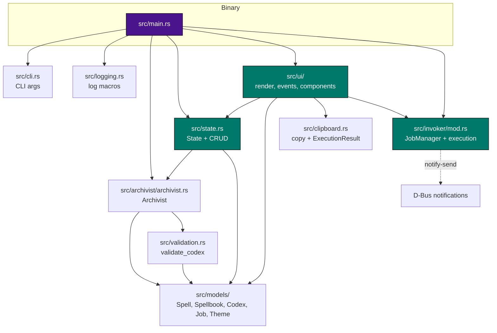
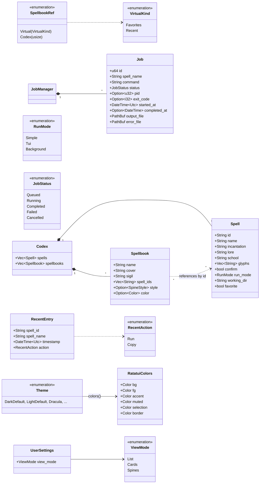
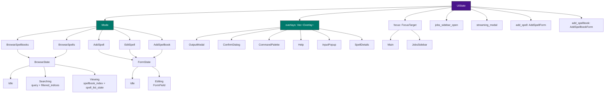
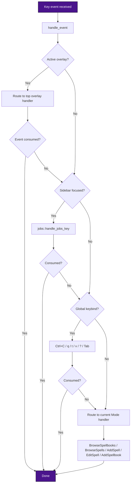
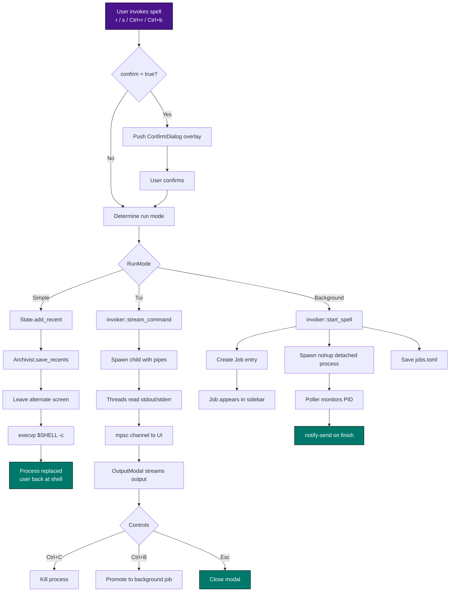
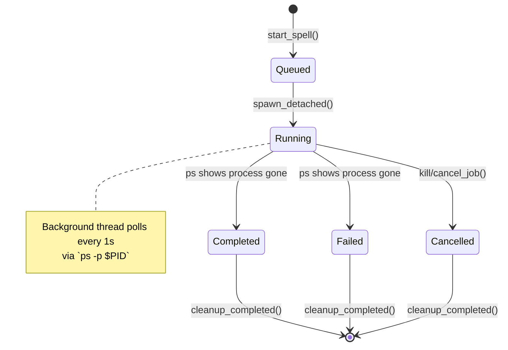
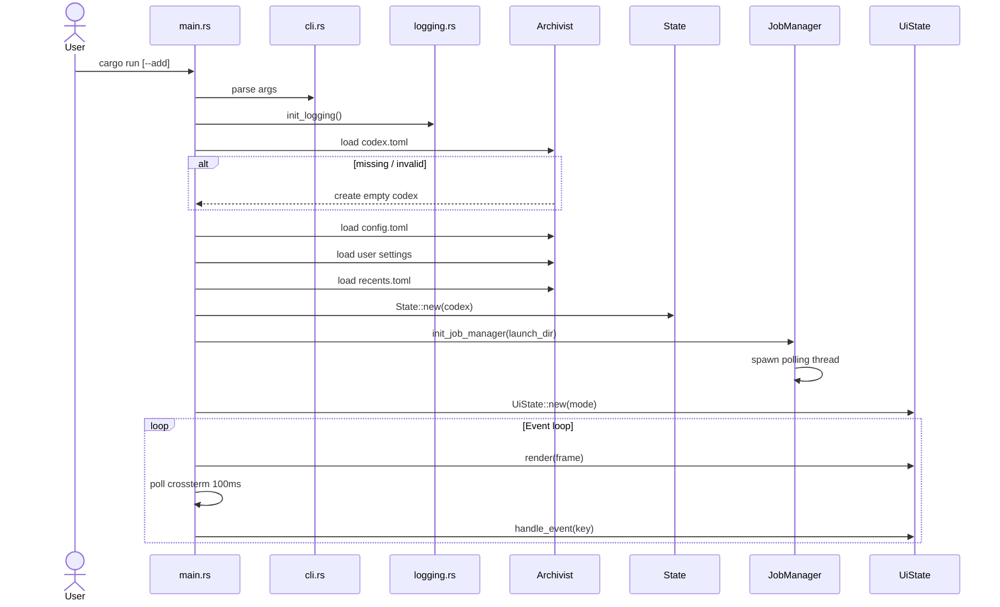
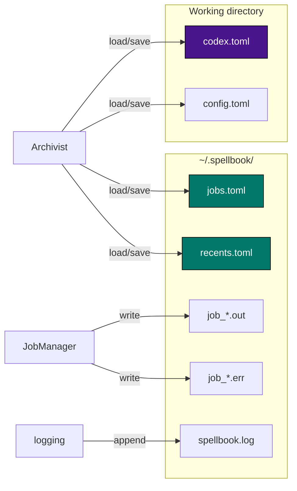
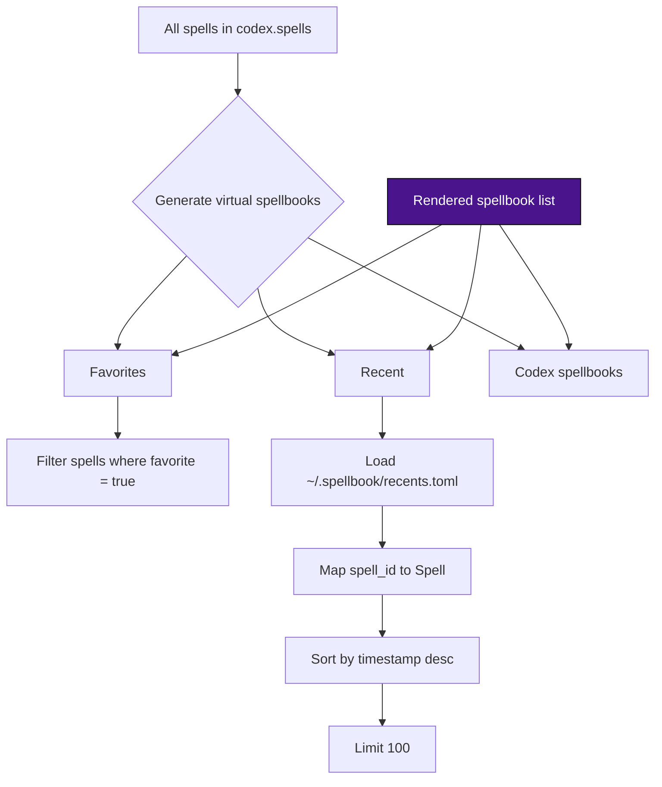
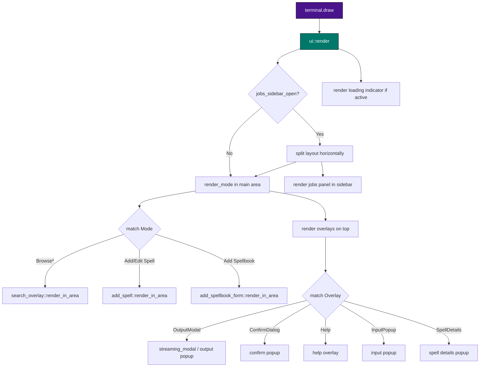

# Spellbook Architecture Diagrams

> Visual reference for the Spellbook codebase. These diagrams use [Mermaid](https://mermaid.js.org/) syntax and render natively in GitHub, GitLab, and most modern Markdown viewers.

---

## 1. Module Dependency Graph



---

## 2. Data Model



---

## 3. UI State Hierarchy



---

## 4. Event Handling Priority



---

## 5. Spell Execution Flow



---

## 6. Job Lifecycle



---

## 7. Application Startup Sequence



---

## 8. Persistence Layer



---

## 9. Virtual Spellbooks



---

## 10. Rendering Pipeline



---

## How to render these locally

If you want PNG/SVG exports, install the Mermaid CLI and run:

```bash
# Using npx
npx @mermaid-js/mermaid-cli -i docs/architecture-diagrams-mermaid.md -o out.svg

# Or with bun
bunx @mermaid-js/mermaid-cli -i docs/architecture-diagrams-mermaid.md -o out.svg
```

For a single diagram, extract the diagram block into a `.mmd` file and run:

```bash
mmdc -i module-graph.mmd -o module-graph.png
```

---

## Key architectural takeaways

1. **Single-mode navigation**: One `Mode` is active at a time; state is nested inside mode variants.
2. **Overlay stack**: Multiple overlays can be pushed; the topmost one gets first chance at input.
3. **Jobs sidebar is not an overlay**: It's a persistent panel with its own `FocusTarget`.
4. **Event priority**: Overlay → Sidebar (if focused) → Global keys → Mode handler.
5. **Atomic persistence**: All TOML writes use `write_to_temp + fs::rename`.
6. **UUID references**: Spells are referenced by ID, not name, enabling safe renames.
7. **Execution modes**: Simple uses `exec()` to replace the process; TUI streams via mpsc; Background uses `nohup` and a polling thread.
8. **Static job manager**: `OnceLock<JobManager>` provides global access after `init_job_manager()` in `main`.
