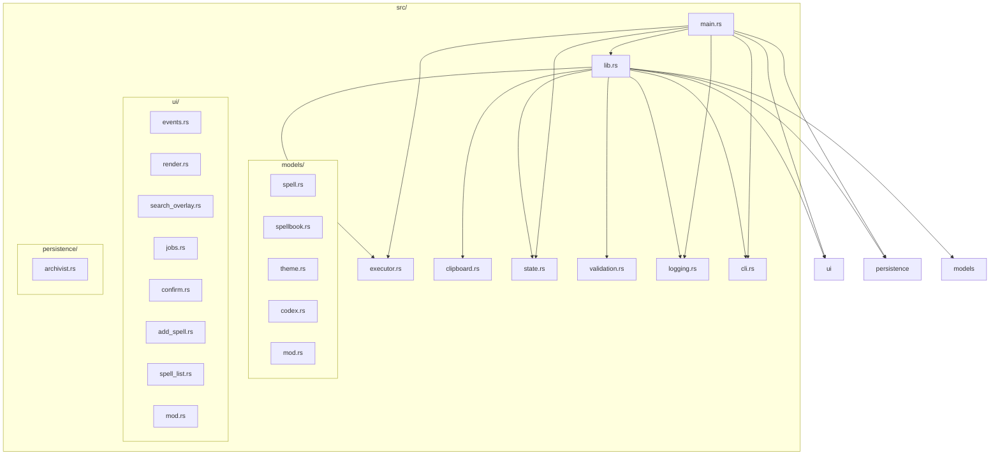
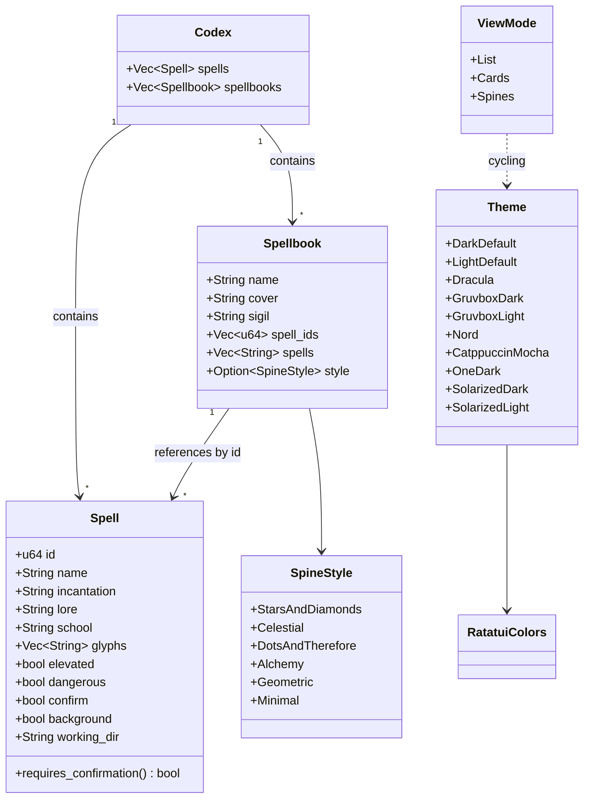
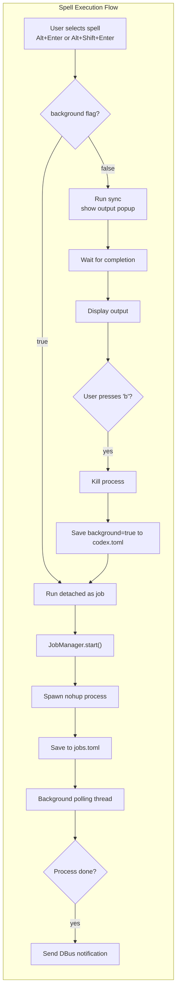
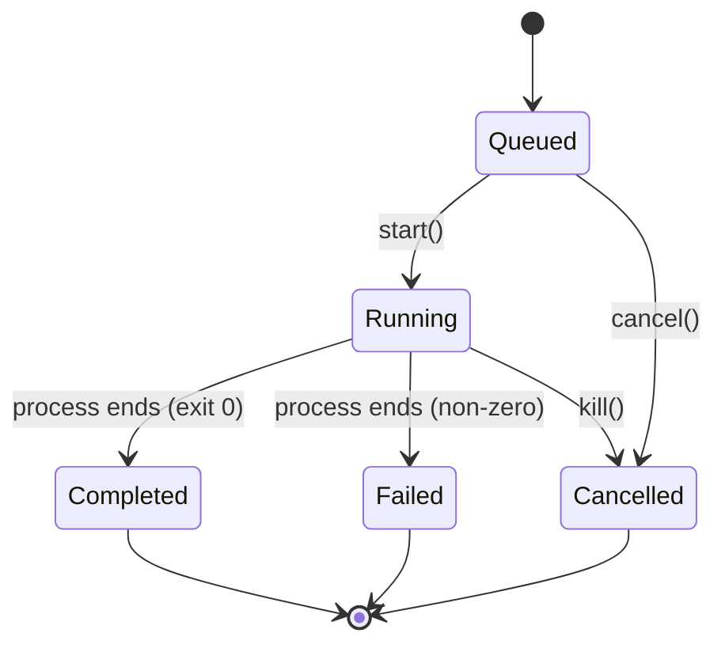
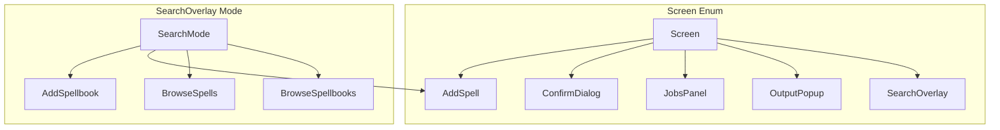
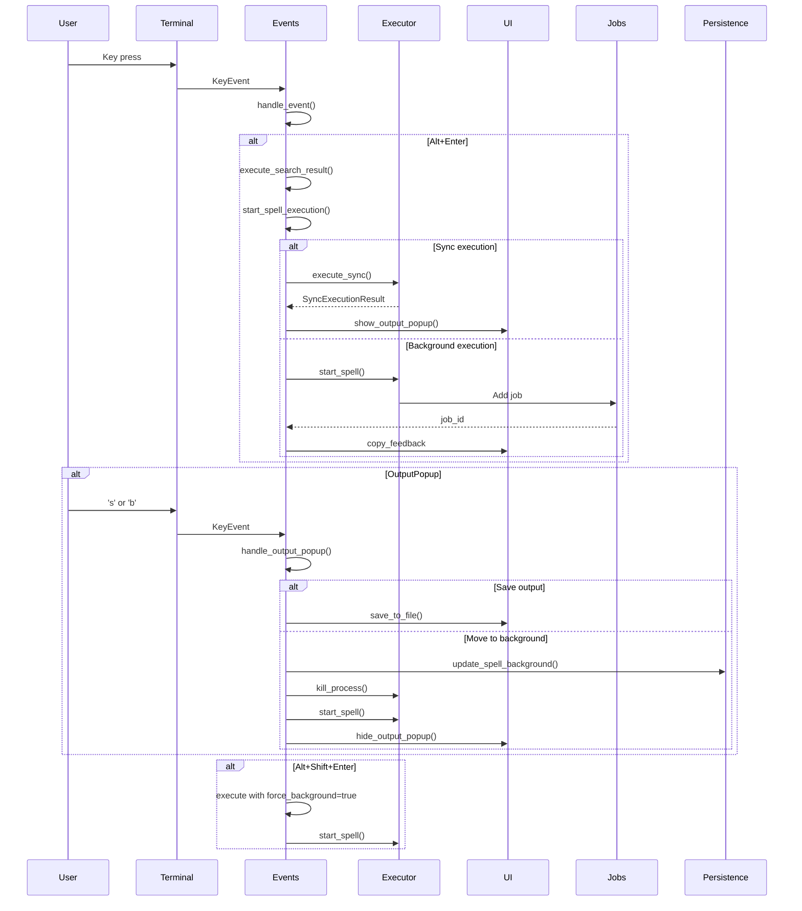
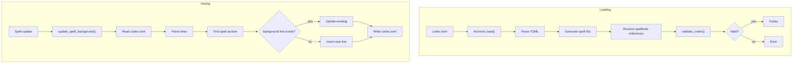
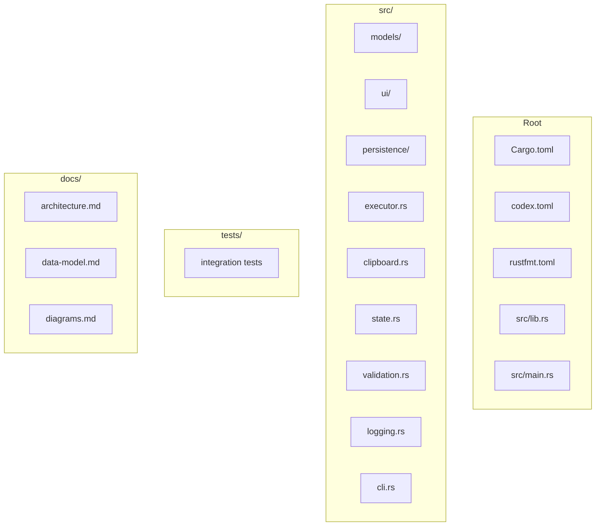
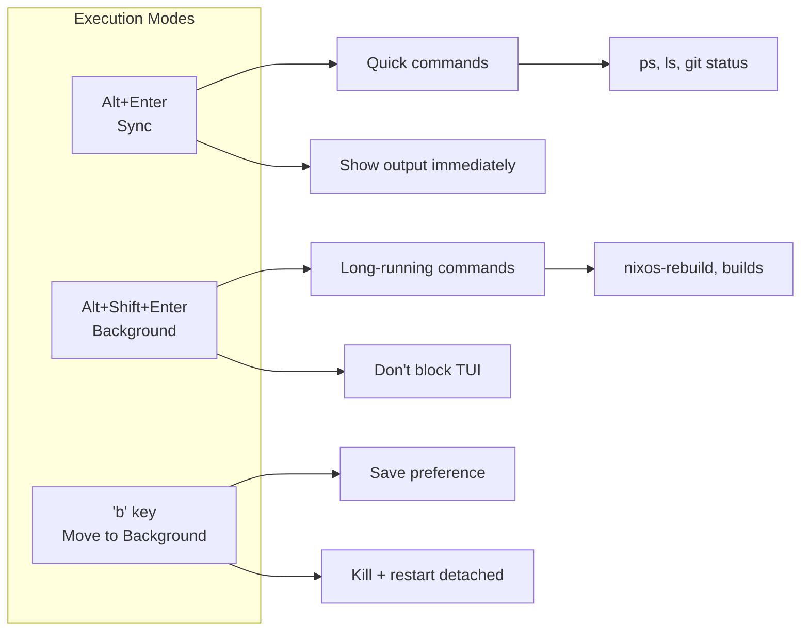

# Spellbook Architecture Diagrams

This document contains architecture diagrams in Mermaid format. View in any Markdown viewer that supports Mermaid (GitHub, VS Code with extension, etc.).

## Module Structure

## Data Models

## Job System Architecture

## Job Lifecycle

## UI Screens

## Event Handling Flow

## Persistence Flow

## File Organization

## Command Execution Options

